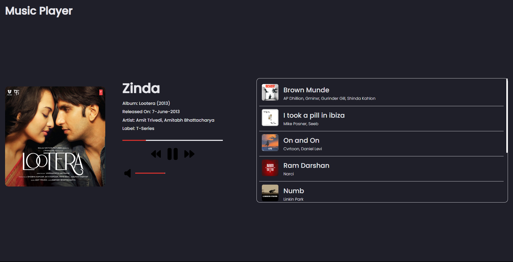

# [Music Player]()

## Languages Used
 
 - HTML 5
 - CSS 3
 - JS

## About Project

This is a simple music player made in HTML, CSS and JS. This simply loads music from playlist.js file into the UI and you can enjoy the music.

P.S. couldn't find the free API which serves free music. So, I decided to write the details manually in playlist.js file.

Thanks!

## Future Improvements 
 - Will be responsive.
 - Will make the progress and volume bar draggable.
 - Maybe I'll add more music to playlist.js file or find a API.